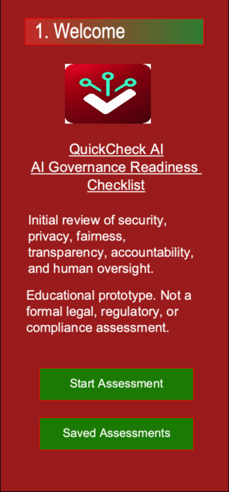
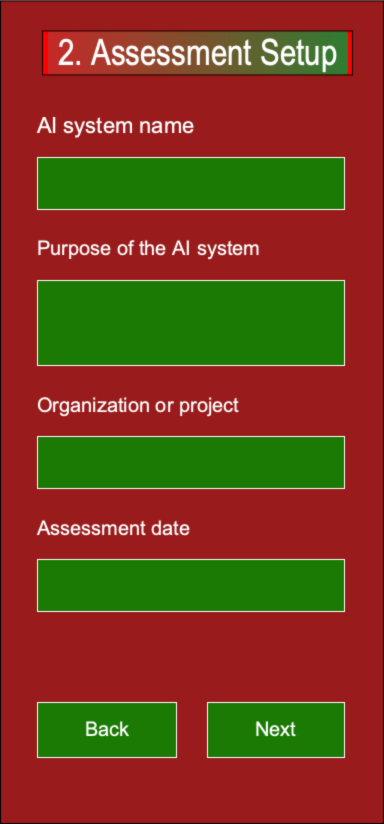
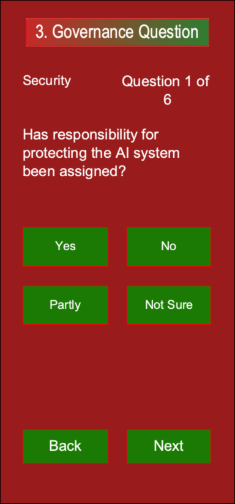
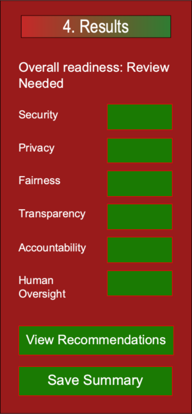
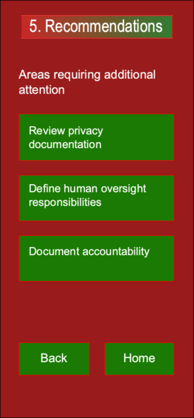
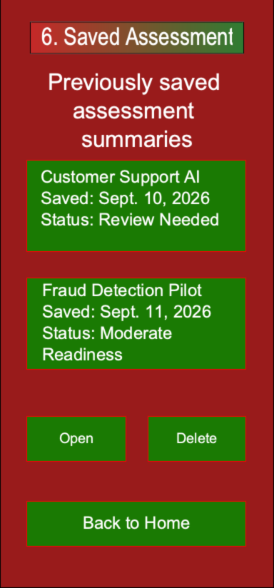

# QuickCheck AI

## Project Focus

This project is a local-first educational prototype that applies my developing knowledge of AI governance. The goal is to organize structured assessment responses into an initial readiness summary and rule-based recommendations.

## Project Description

QuickCheck AI is an Android application prototype intended to help a user conduct an initial review of a proposed or existing artificial intelligence system. The application organizes draft questions into six governance categories:

- Security
- Privacy
- Fairness
- Transparency
- Accountability
- Human oversight

The current prototype includes the branded Welcome screen, navigation across five Android activities, assessment setup fields, and an initial 18-question bank. Category scoring, readiness levels, recommendations, and saved-assessment storage remain planned features.

The intended users may include students, developers, cybersecurity professionals, project owners, and governance personnel who need a structured starting point for discussing AI risk. The course version will be a single-user, local-first educational prototype. It will not provide a legal, regulatory, certification, or compliance determination.

## Problem Being Addressed

AI governance considerations may be spread across security, privacy, fairness, transparency, accountability, and human-oversight guidance. This may make an initial review difficult for someone who is still learning about AI governance.

The proposed application will present these considerations through a guided mobile assessment and translate the responses into an organized summary. It will not replace a formal assessment. Its purpose is to help users identify possible gaps, document preliminary observations, and determine where additional review may be needed.

## Development Platform

- **Target platform:** Android mobile devices
- **Programming language:** Java
- **Development environment:** Android Studio with the Android SDK
- **Testing environment:** Android Studio emulator and a physical Android device
- **Version control and documentation:** Git and GitHub

## Front-End and Back-End Support

### Front End

The interface currently uses Android activities, XML layouts, standard form controls, buttons, radio buttons, and a progress indicator. Navigation connects Welcome, Assessment Setup, Questions, placeholder Results, and placeholder Saved Assessments screens. The remaining screens still require full wireframe styling and accessibility review.

### Local Back End

The idea is for the prototype to store assessment records, responses, category scores, results, and recommendations on the device. SQLite or the Android Room persistence library will be evaluated before implementation.

### Business Logic

Java classes are expected to validate required fields, convert responses into numeric values, calculate category and overall scores, assign readiness levels, and select rule-based recommendations.

### Future Cloud Support

A later version may use Firebase for authentication, synchronized storage, multi-user access, and audit history. These features are outside the current minimum course scope.

### Security Considerations

The application is intended to minimize permissions, avoid unnecessary personal data, validate input, and keep prototype data within application-controlled storage.

## Current Implementation

- Branded Welcome screen with the approved QuickCheck AI color palette, logo, purpose, and educational disclaimer
- Five Java activities connected through explicit Android intents
- Assessment Setup fields for basic system information
- An initial bank of 18 provisional questions, three per governance category
- Yes, No, Partly, and Not Sure response options
- Required response selection before advancing
- Back and Next navigation with temporary answer retention during the current Question activity
- A local unit test that checks the question-bank structure

## Planned Functionality

- Validate and map the question bank to a selected governance framework
- Preserve assessment state across screen rotation and application recreation
- Calculate transparent category scores and an overall readiness classification
- Display rule-based recommendations for categories requiring attention
- Save, view, search, reopen, and delete completed assessments locally
- Complete the Results and Saved Assessments screens
- Test the complete flow on an emulator and physical Android device

## Assessment and Scoring Approach

The current response scale is **Yes**, **No**, **Partly**, and **Not Sure**. Planned scoring will be transparent and rule-based rather than using artificial intelligence to evaluate responses.

A recognized AI-governance framework and the final question weights will be selected during the research and design phase. The question sources, scoring rules, and assumptions will be documented before implementation. The application will distinguish between an educational readiness indicator and a formal risk or compliance judgment.

## Design and Wireframes

The wireframes use a red background, green controls, white text, and a red-to-green heading treatment based on the QuickCheck AI logo. The interface uses readable labels, large touch targets, visible progress, predictable navigation, and concise explanations for governance terms.

The final Android layouts may change after testing, learning, and feedback. The current wireframes and their editable Justinmind source are included in this repository.

### Wireframe Files

- [Complete wireframe PDF](docs/wireframes/QuickCheck-AI-Wireframes.pdf)
- [Editable Justinmind project](docs/wireframes/QuickCheck-AI-Wireframes.vp)

### Screen Previews

| Welcome | Assessment Setup | Governance Question |
| --- | --- | --- |
|  |  |  |

| Results | Recommendations | Saved Assessments |
| --- | --- | --- |
|  |  |  |

## Project Goals and Success Criteria

- A user can create and complete an assessment without encountering a blocking error.
- Completed assessments can be stored and retrieved after the app is closed and reopened.
- The same responses consistently produce the same category scores and readiness level.
- The results screen identifies areas requiring attention and displays relevant recommendations.
- The application navigates across multiple activities on a physical Android device.
- The repository contains current code and readable documentation.

## Current Limitations

- Single-user operation
- Local storage only
- No formal legal, regulatory, certification, or compliance determination
- The governance framework and scoring method have not been selected
- The 18 questions are provisional and have not been validated as a formal assessment instrument
- Results, recommendations, and saved-assessment storage are not yet implemented
- Temporary answers are not yet preserved across rotation or application recreation

## Documentation

- **Project Wiki:** https://github.com/OsymBah87/COM-437/wiki
- **Repository:** https://github.com/OsymBah87/COM-437
- **Android source:** `android/`

## Disclaimer

This is a student-developed educational prototype. It is not intended to replace a formal legal, regulatory, compliance, or organizational risk assessment.
