# QuickCheck AI

## Project Focus

This project is a local-first educational prototype that applies my developing knowledge of AI governance using the NIST Artificial Intelligence Risk Management Framework 1.0 as its selected framework. The goal is to organize structured assessment responses into an initial readiness summary and rule-based recommendations.

## Project Description

QuickCheck AI is an Android application prototype intended to help a user conduct an initial review of a proposed or existing artificial intelligence system. The application organizes draft questions into six governance categories:

- Security
- Privacy
- Fairness
- Transparency
- Accountability
- Human oversight

The current prototype includes the branded Welcome screen, navigation across five Android activities, assessment setup validation, an initial 18-question bank, transparent category scoring, readiness levels, rule-based recommendations, and local saved-assessment storage.

The intended users may include students, developers, cybersecurity professionals, project owners, and governance personnel who need a structured starting point for discussing AI risk. The course version will be a single-user, local-first educational prototype. It will not provide a legal, regulatory, certification, or compliance determination.

## Problem Being Addressed

AI governance considerations may be spread across security, privacy, fairness, transparency, accountability, and human-oversight guidance. This may make an initial review difficult for someone who is still learning about AI governance.

The proposed application will present these considerations through a guided mobile assessment and translate the responses into an organized summary. It will not replace a formal assessment. Its purpose is to help users identify possible gaps, document preliminary observations, and determine where additional review may be needed.

## Development Platform

- **Target platform:** Android mobile devices
- **Programming language:** Java
- **Development environment:** Android Studio with the Android SDK
- **Testing environment:** Android Studio emulator and a physical Android device
- **Version control and documentation:** Git and GitHub

## Front-End and Back-End Support

### Front End

The interface currently uses Android activities, XML layouts, standard form controls, buttons, radio buttons, and a progress indicator. Navigation connects Welcome, Assessment Setup, Questions, Results, and Saved Assessments. All five implemented screens use the approved QuickCheck AI palette and logo treatment. Android lint reports no layout accessibility errors, although assistive-technology and physical-device testing remain required.

### Local Back End

The prototype uses a local SQLite database through `SQLiteOpenHelper`. Each saved record includes the system information, response identifiers, category scores, overall score, readiness level, and creation time. Saved records remain on the device and can be listed and reopened.

### Business Logic

Java classes validate required fields, convert responses into numeric values, calculate category and overall scores, assign readiness levels, and select rule-based recommendations.

### Future Cloud Support

A later version may use Firebase for authentication, synchronized storage, multi-user access, and audit history. These features are outside the current minimum course scope.

### Security Considerations

The application is intended to minimize permissions, avoid unnecessary personal data, validate input, and keep prototype data within application-controlled storage.

## Current Implementation

- Branded Welcome screen with the approved QuickCheck AI color palette, logo, purpose, and educational disclaimer
- Five Java activities connected through explicit Android intents
- Assessment Setup fields for basic system information
- An initial bank of 18 provisional questions, three per governance category
- Yes, No, Partly, and Not Sure response options
- Required response selection before advancing
- Back and Next navigation with question-index and response retention during screen rotation
- Transparent scoring across all six governance categories
- Overall readiness levels and recommendations for categories below 75%
- Local SQLite saving, listing, and reopening of completed assessments
- A local unit test that checks the question-bank structure
- Local unit tests for all-Yes, all-Partly, all-No, and mixed-response scoring examples
- Scorer rejection of incomplete, mismatched, or unknown response data
- Connected emulator tests for blank setup, unanswered questions, and system Back navigation

## Planned Functionality

- Validate and map each question to the NIST AI RMF 1.0 Core functions and relevant categories or subcategories
- Add deliberate update and deletion operations for saved assessments if required
- Add search or filtering if required after the minimum course flow is stable
- Test scoring boundaries with additional manually verified response combinations
- Test the complete flow on an emulator and physical Android device

## Course Minimum Viable Product Scope

The course version is limited to a single-user, local-first educational Android prototype. Its minimum scope is frozen as follows:

- Collect basic information about an AI system or project
- Present 18 questions across six governance categories
- Require one response to each question
- Preserve assessment state during the intended user flow
- Calculate transparent category and overall readiness results
- Display rule-based recommendations tied to categories requiring attention
- Save, list, and reopen assessments locally
- Demonstrate the complete flow on an Android device

Cloud synchronization, authentication, multi-user collaboration, AI-generated recommendations, advanced charts, report export, location services, networking, and enterprise audit infrastructure are outside the course  scope.

## Assessment and Scoring Approach

The current response scale is **Yes**, **No**, **Partly**, and **Not Sure**. The implemented scoring assigns 3 points to Yes, 2 to Partly, 1 to Not Sure, and 0 to No. Each category contains three questions and is converted into a percentage. The overall percentage uses all 18 responses.

Scores of 75% to 100% receive **Higher Readiness**, 50% to 74% receive **Developing Readiness**, and scores below 50% receive **Needs Attention**. A recommendation is displayed for every category below 75%. These thresholds are preliminary course-project rules, not validated compliance or risk thresholds.

The selected framework is the NIST Artificial Intelligence Risk Management Framework 1.0, NIST AI 100-1. NIST describes the framework as voluntary, rights-preserving, non-sector-specific, and use-case agnostic. QuickCheck AI uses it as the organizing foundation for the course prototype. The current questions have not yet been mapped individually to the Govern, Map, Measure, and Manage functions or their categories and subcategories. The application therefore distinguishes between an educational readiness indicator and a formal risk or compliance judgment.

## Design and Wireframes

The wireframes use a red background, green controls, white text, and a red-to-green heading treatment based on the QuickCheck AI logo. The interface uses readable labels, large touch targets, visible progress, predictable navigation, and concise explanations for governance terms.

The final Android layouts may change after testing, learning, and feedback. The current wireframes and their editable Justinmind source are included in this repository.

### Wireframe Files

- [Complete wireframe PDF](docs/wireframes/QuickCheck-AI-Wireframes.pdf)
- [Editable Justinmind project](docs/wireframes/QuickCheck-AI-Wireframes.vp)

### Screen Previews

| Welcome | Assessment Setup | Governance Question |
| --- | --- | --- |
| 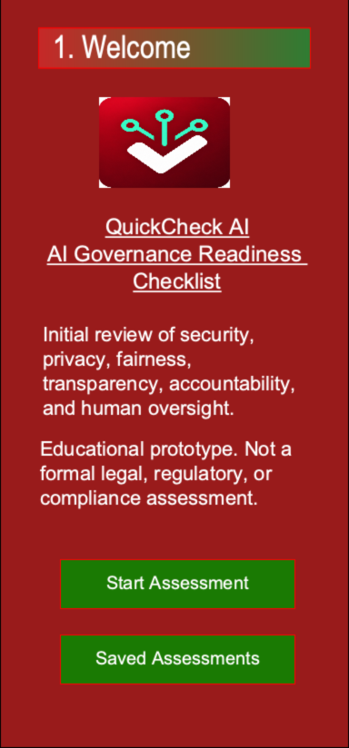 | 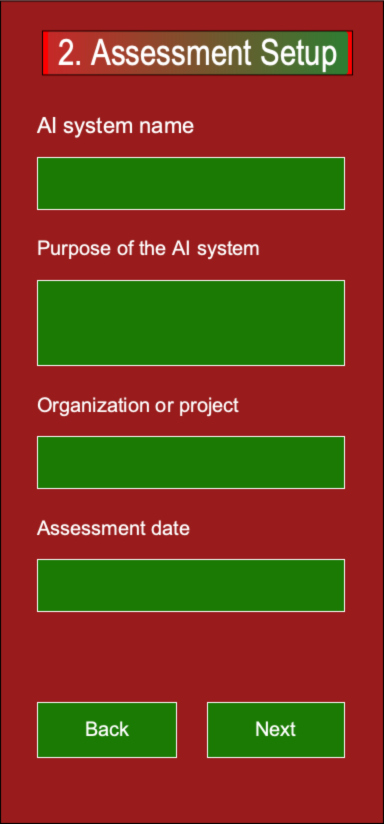 | 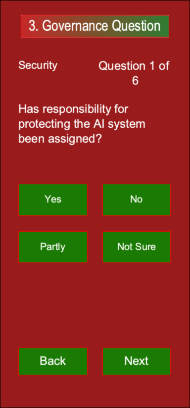 |

| Results | Recommendations | Saved Assessments |
| --- | --- | --- |
| 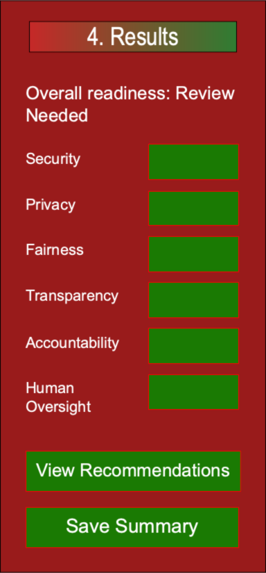 | 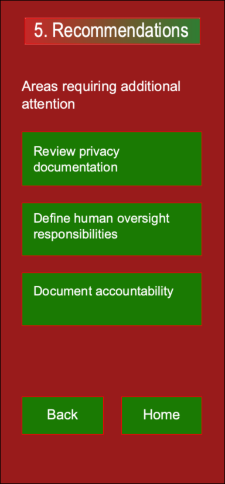 | 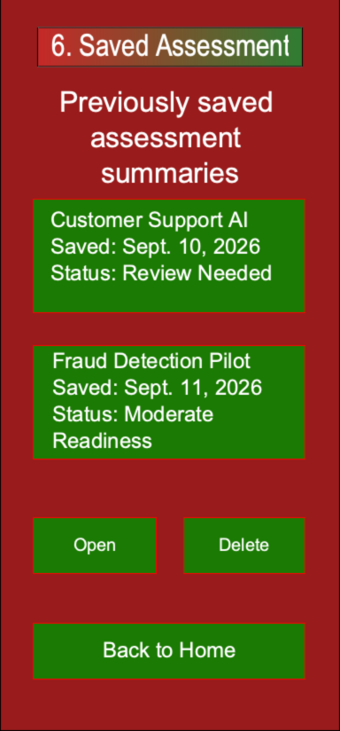 |

### Current Android Prototype

| Welcome | Assessment Setup | Governance Question |
| --- | --- | --- |
| 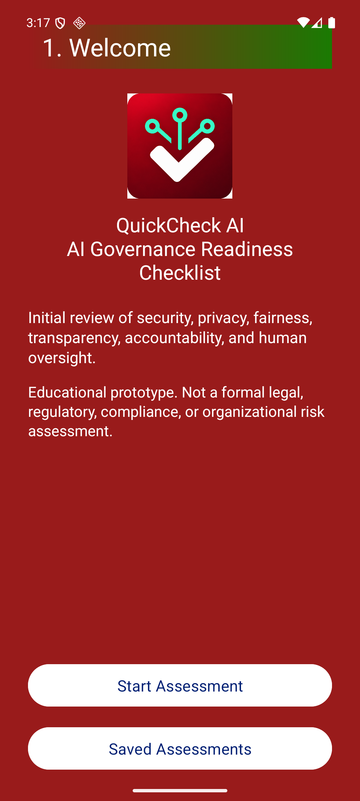 | 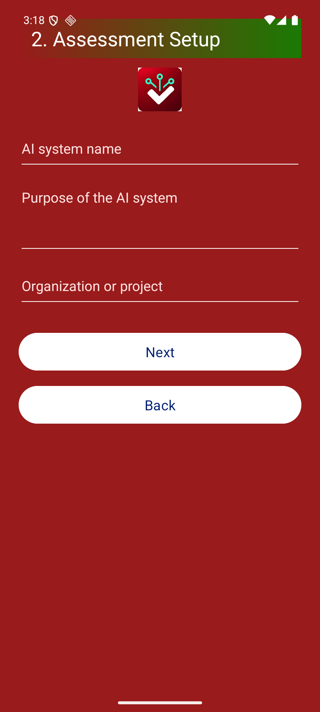 | 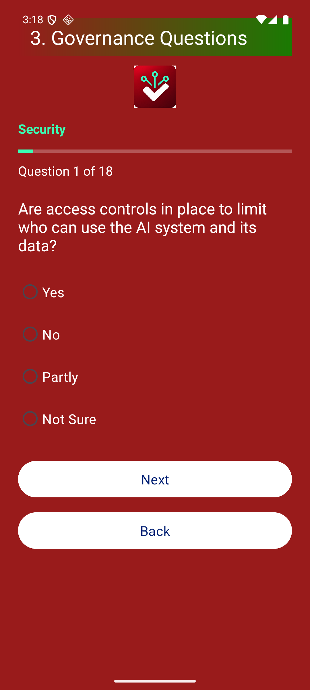 |

| Results | Saved Assessments |
| --- | --- |
| 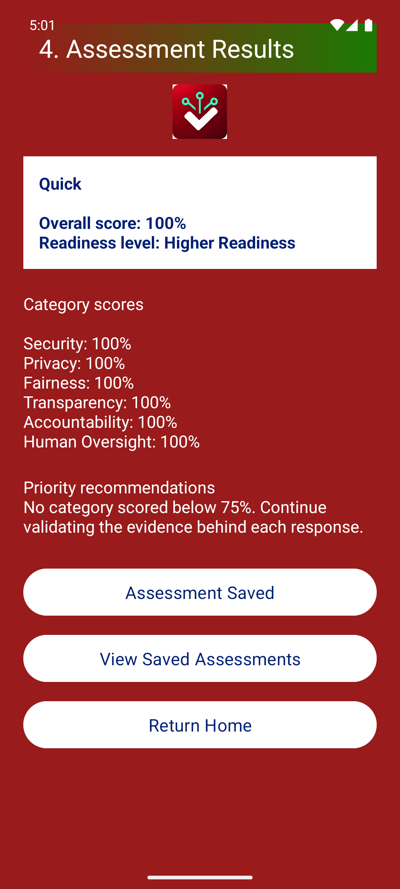 | 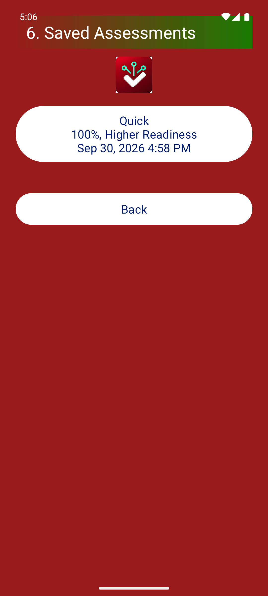 |

## Project Goals and Success Criteria

- A user can create and complete an assessment without encountering a blocking error.
- Completed assessments can be stored and retrieved after the app is closed and reopened.
- The same responses consistently produce the same category scores and readiness level.
- The results screen identifies areas requiring attention and displays relevant recommendations.
- The application navigates across multiple activities on a physical Android device.
- The repository contains current code and readable documentation.

## Current Limitations

- Single-user operation
- Local storage only
- No formal legal, regulatory, certification, or compliance determination
- NIST AI RMF 1.0 is selected, but the provisional questions have not yet been individually mapped or validated against its Core functions, categories, and subcategories
- The scoring rules are transparent but preliminary and have not been validated as risk or compliance thresholds
- The 18 questions are provisional and have not been validated as a formal assessment instrument
- Saved assessments are read-only after completion; update, deletion, search, and export are not implemented
- Process-death recovery, assistive-technology testing, and physical-device testing remain incomplete

## Version Changelog

| Version stage | Confirmed work | Status or next update |
| --- | --- | --- |
| Previous | Created the project outline, completed six digital wireframes, added five connected Activities, implemented the approved interface, and added the provisional 18-question bank. | Published through the earlier repository updates and pull request #2. |
| Current | Added setup validation, transparent scoring, six category scores, three readiness levels, rule-based recommendations, SQLite saving, a saved-assessment list, record reopening, scoring input validation, and local and connected tests. The all-Yes example was completed, saved, listed, and reopened. Mixed scoring, blank setup, unanswered questions, and system Back paths were also tested on the Pixel 7 API 36 emulator. | Local work verified through 4 October 2026; not yet committed or published. |
| Future | Map and validate the questions against NIST AI RMF 1.0, verify true process-death recovery, decide whether saved records require update or deletion, complete physical-device and assistive-technology testing, and prepare the Week 8 demonstration. | Planned and not yet complete. |

## Documentation

- **Project Wiki:** https://github.com/OsymBah87/COM-437/wiki
- **Repository:** https://github.com/OsymBah87/COM-437
- **Android source:** `android/`

## Disclaimer

This is a student-developed educational prototype. It is not intended to replace a formal legal, regulatory, compliance, or organizational risk assessment.

## Framework Reference

Tabassi, E. (2023). *Artificial Intelligence Risk Management Framework (AI RMF 1.0)* (NIST AI 100-1). National Institute of Standards and Technology. https://doi.org/10.6028/NIST.AI.100-1
